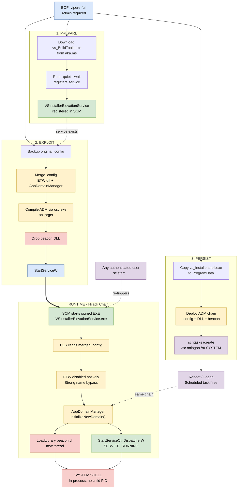

# Vipere 


special thanks to [Sans23](https://github.com/requin-citron)


---

## Demo


https://github.com/user-attachments/assets/5db7d617-1717-4ca2-ab5f-2149c36e9a39


## What is this?

Vipere exploits a chain of three weaknesses in the Visual Studio Installer Elevation Service to achieve **persistent SYSTEM execution** triggered by any standard user.

| Weakness | Detail |
|----------|--------|
| **Permissive SDDL** | `SERVICE_START` granted to all Authenticated Users (`AU`) |
| **No config integrity check** | .NET CLR loads `appDomainManagerAssembly` without signature verification |
| **Orphaned service registration** | Service entry persists in HKLM after VS uninstallation |

No single weakness is a vulnerability on its own, the **combination** creates a reliable LPE + persistence chain.

## How It Works



### AppDomainManager Hijacking + ETW Evasion

The signed Microsoft binary is **never replaced**. Three small files are added alongside:

```
C:\Program Files (x86)\Microsoft Visual Studio\Installer\
  VSInstallerElevationService.exe               -- UNTOUCHED (Microsoft signed)
  VSInstallerElevationService.exe.config        -- INJECTED (.config with ETW kill)
  Microsoft.VS.ConfigurationManager.dll         -- AppDomainManager (compiled on-target via csc.exe)
  Microsoft.VS.ConfigurationHost.dll            -- your beacon DLL
```

The `.config` is **merged** into the original - all 22+ binding redirects are preserved. If no original exists, a standalone config is used instead.

On service start, the .NET CLR reads the config which:
1. **Disables ETW** natively (`<etwEnable enabled="false"/>`) - EDR is blind
2. **Bypasses strong name checks** (`<bypassTrustedAppStrongNames enabled="true"/>`)
3. **Loads the AppDomainManager** which calls `LoadLibrary` on your beacon DLL

The AppDomainManager also **takes over SCM registration** - it calls `StartServiceCtrlDispatcherW` and reports `SERVICE_RUNNING`, so the service stays alive indefinitely. No child process, no parent-child relationship visible to EDR.

```
Service process (SYSTEM)
  \_ CLR init -> AppDomainManager.InitializeNewDomain()
       |_ Thread: LoadLibrary("beacon.dll") -> beacon runs in-process
       \_ StartServiceCtrlDispatcherW -> SCM sees SERVICE_RUNNING
            \_ process stays alive until sc stop
```

### Persistence via Scheduled Task

`persist` creates a second AppDomainManager chain in a separate directory using a different .NET binary:

```
C:\ProgramData\Microsoft\VisualStudio\Updates\
  vs_installershell.exe                         -- copy of legit .NET binary
  vs_installershell.exe.config                  -- AppDomainManager + ETW kill
  Microsoft.VS.ConfigurationManager.dll         -- compiled on-target
  Microsoft.VS.ConfigurationHost.dll            -- your beacon DLL
```

A scheduled task (`Microsoft\VisualStudio\UpdateCheckService`) runs the binary as SYSTEM at every logon.

### Bootstrap Mode (virgin machine)

Downloads the official `vs_BuildTools.exe` from `https://aka.ms/vs/17/release/vs_BuildTools.exe`, runs it silently to register the service, then uses AppDomainManager hijacking. All traffic goes to `microsoft.com` over HTTPS via WinHTTP.

## Usage

### CobaltStrike

Load `vipere.cna` in the Script Manager. Commands are available as beacon aliases:

```
vipere-check
vipere-full /path/to/beacon.dll
vipere-cleanup
```

### Adaptix

Load `vipere.axs` as an extension. Commands register under the `vipere` group:

```
vipere-check
vipere-full <beacon.dll>
vipere-cleanup
```

### Generic COFF Loader

Load `dist/lpe_vs_bootstrap.x64.o` and pass a zero-terminated string (command) + optional binary blob (DLL bytes):

| Arg | Format | Description |
|-----|--------|-------------|
| 1 | `z` (string) | Command: `check`, `prepare`, `exploit`, `persist`, `full`, `cleanup` |
| 2 | `b` (binary) | Beacon DLL bytes (required for `exploit`, `persist`, `full`) |

Payload is any beacon DLL that supports `LoadLibrary` loading (DllMain entry point).

### Commands

| Command | Action |
|---------|--------|
| `check` | Detect service state + persistence artifacts |
| `prepare` | Download VS Installer from microsoft.com (creates service) |
| `exploit <dll>` | AppDomainManager hijack on service -> SYSTEM |
| `persist <dll>` | Copy vs_installershell.exe + AppDomainManager + Scheduled Task |
| `full <dll>` | prepare + exploit + persist (one-shot) |
| `cleanup` | Stop service, kill persist process, remove all artifacts, restore original .config |

## Output Examples

**Full (service already exists):**
```
[*] Vipere PREPARE
[+] Service already exists — skipping download
[*] Vipere EXPLOIT
[+] Service RUNNING — beacon loaded as SYSTEM
[*] Vipere PERSIST
[+] Scheduled task created (triggers at logon)
```

**Check (after exploit + persist):**
```
[*] Vipere CHECK
[+] Service registered
    Binary: YES
    .config hijack: YES
    AppDomainManager: YES
    Beacon DLL: YES
    Config backup: YES
[*] Persistence:
    Persist dir: YES
    Persist EXE: YES
    Persist beacon: YES
```

**Cleanup:**
```
[*] Vipere CLEANUP
[+] Original .config restored
[+] Scheduled task + persist dir removed
[+] Cleaned
```

## Persistence

| Mechanism | Trigger | Survives |
|-----------|---------|----------|
| **SCM registration** | AppDomainManager registers as service -> process stays alive | Runs until `sc stop` |
| **Scheduled task** | Logon -> `vs_installershell.exe` as SYSTEM | Reboots, VS uninstallation |

Any authenticated user can re-trigger the service beacon:
```cmd
sc start VSInstallerElevationService
```

## Requirements

| Phase | Privilege | Internet | VS Required |
|-------|:---------:|:--------:|:-----------:|
| prepare | Admin | Yes | No |
| exploit | Admin | No | Service must exist |
| persist | Admin | No | vs_installershell.exe must exist |
| **trigger** | **Any user** | **No** | **Service must exist** |
| cleanup | Admin | No | No |

## OPSEC Considerations

| Aspect | Detail |
|--------|--------|
| **Binary replacement** | None - signed binary is untouched |
| **ETW** | Killed natively via .config - no patching, no unhooking |
| **File names** | `Microsoft.VS.ConfigurationHost.dll` / `ConfigurationManager.dll` - credible VS names |
| **Compilation** | AppDomainManager compiled on-target via `csc.exe` - no unsigned DLL transferred |
| **Child processes** | None - beacon loaded via `LoadLibrary` in-process |
| **Network traffic** | `aka.ms` / `download.visualstudio.microsoft.com` - legitimate Microsoft domains |
| **Bootstrapper** | `vs_BuildTools.exe` is Authenticode-signed by Microsoft |
| **SCM registration** | AppDomainManager registers as the service via `StartServiceCtrlDispatcherW` - SCM sees a normal service lifecycle |
| **Config merge** | Injects directives into original `.config` preserving all binding redirects - diff is minimal |
| **Service creation** | None - reuses existing VS Installer registration |
| **Scheduled task** | Named `Microsoft\VisualStudio\UpdateCheckService` - blends with legitimate VS tasks |
| **Cleanup** | Restores original .config from backup, kills persist process, removes all artifacts |

## Build

```bash
make
```

**Requires:** `x86_64-w64-mingw32-g++` (mingw-w64 cross-compiler)

**Project structure:**
```
vipere/
|_ vipere.cna                      # CobaltStrike aggressor script
|_ vipere.axs                      # Adaptix extension
|_ Demo.mp4                        # Demo video
|_ Makefile
|_ src/
|  |_ lpe_vs_bootstrap_bof.cpp     # BOF source
|  \_ beacon.h
\_ dist/
   \_ lpe_vs_bootstrap.x64.o       # compiled BOF
```

## Tested On

- Windows 11 25H2 Build 26200 (July 2026: fully patched)
- Visual Studio 2022 Build Tools 17.x
- Windows Defender (current definitions)

## Related Work

- [Unit42: Screening Serpens](https://unit42.paloaltonetworks.com/tracking-iran-apt-screening-serpens/) (AppDomainManager hijacking by Iranian APT - ETW evasion technique)
- [CYFIRMA: Operation PhantomCLR](https://www.cyfirma.com/research/phantomclr/) (Same T1574.014 technique in the wild)

## License

MIT
